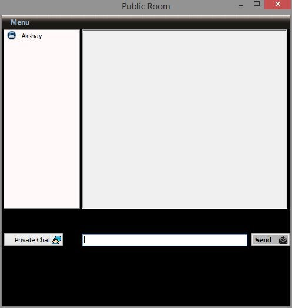
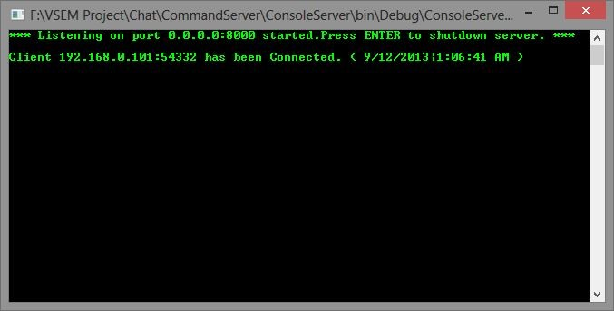
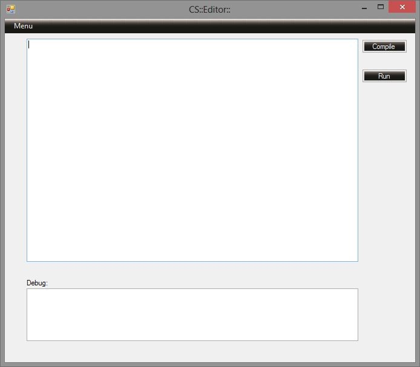
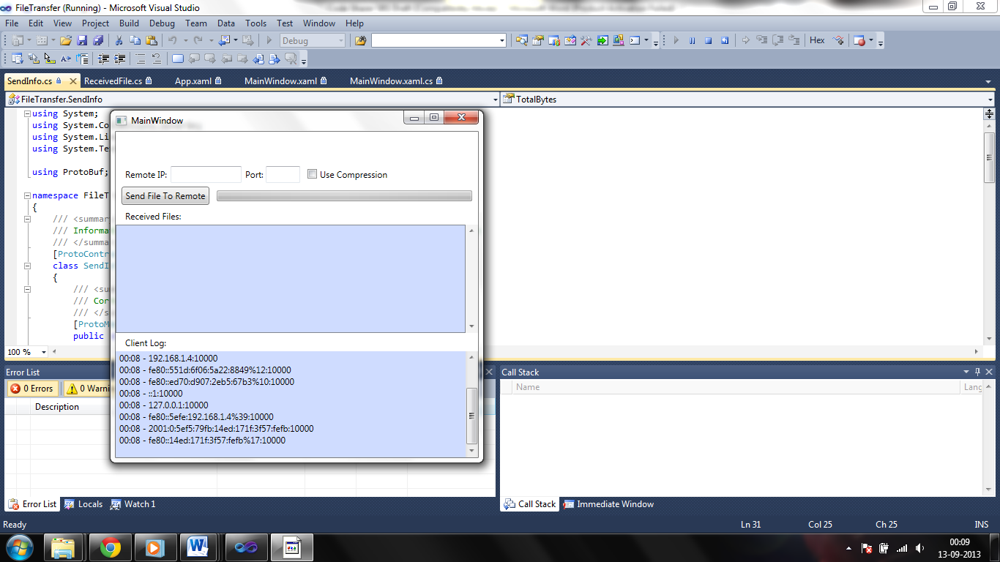

# Code Sharer (CS)
## Introduction
Code Sharer (CS) is a software which is meant to aid programmers especially beginners. This software helps programmers resolve bugs in the source code by sharing code
snippets with their peers at the touch of a button. Code Sharer (CS) is an easy to use texteditor which provides an interactive Integrated Development Environment (IDE) to
compile simple codes and detect errors with ease. With features like bug highlighting, syntax correction and a chat interface, Code Sharer (CS) is the idle solution to a
programmer’s woes.
With the help of Code Sharer (CS), a teacher or a team member can demonstrate and share their programs with a group of other programmers for learning and understanding
all at runtime. Programmers can also share screenshots of their codes with others. This software brings a new evolution to programming in a network and the possibilities of
future developments are endless. Code Sharer aims to be a handy tool for every programmer and help them communicate and share their programs with others without hassle.

## Modules
> * C / C++ Editor
> * Snippet share / File share
> * Screenshot / Print screen
> * Chat

## Screenshots

##Bugs and Feedback
For bugs, questions and discussions please use the [Github Issues](https://github.com/aksh4y/CS/issues).
